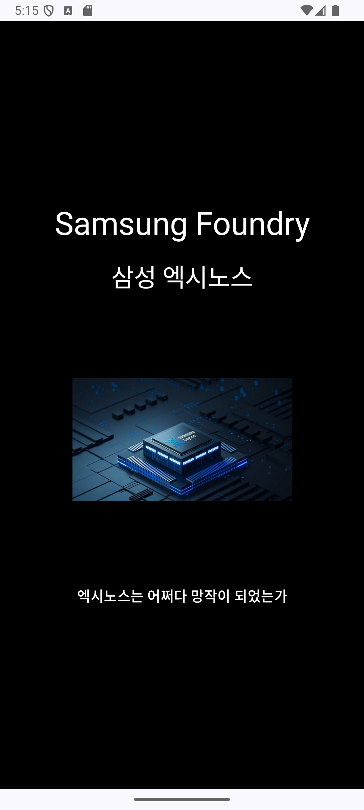
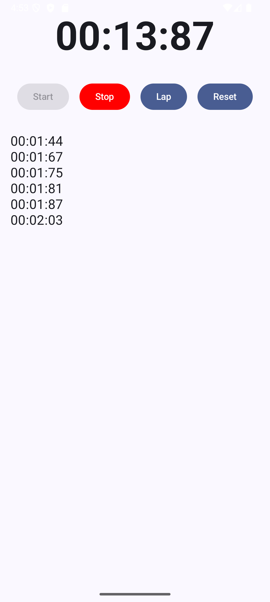

# BGW-MOBILE
모바일 앱 실습
Space
<!DOCTYPE HTML>

<table border="0" cellpadding="0" cellspacing="0">

  <tr>
    <td>
      <table border="1" frame="box" rules="cols" cellspacing="0" cellpadding="5">
        <tr>
          <td align="center" valign="middle">
            
          </td>
          <td align="center" valign="middle">
            
          </td>
          <td align="center" valign="middle">
            
          </td>
          <td align="center" valign="middle">
            
          </td>
        </tr>
      </table>
    </td>
  </tr>

  <tr>
    <td>
      <table border="0" cellspacing="0" cellpadding="5">
        <tr>
          <td align="center" valign="top" width="150px">
            <strong>삼성 엑시노스 소개</strong> 
            간단한 소개 화면입니다.
          </td>
          <td align="center" valign="top" width="150px">
            <strong>전화 다이얼 앱</strong> 
            Jetpack Compose로 만든 다이얼 UI
          </td>
          <td align="center" valign="top" width="150px">
            <strong>스톱워치</strong> 
            시간 및 랩 타임 측정 기능
          </td>
          <td align="center" valign="top" width="150px">
            <strong>미니 게임</strong> 
            간단한 터치 게임 화면
          </td>
        </tr>
      </table>
    </td>
  </tr>

</table>

